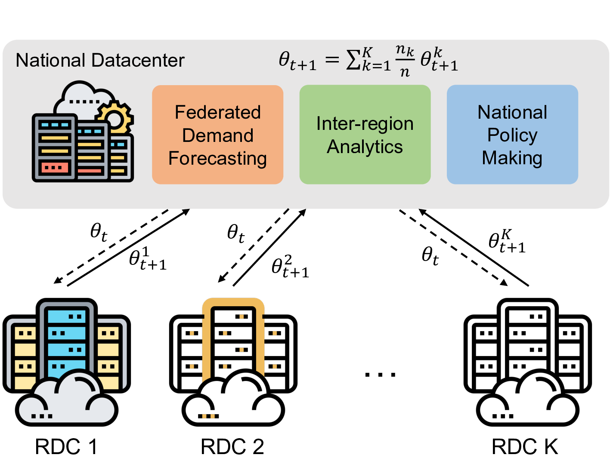
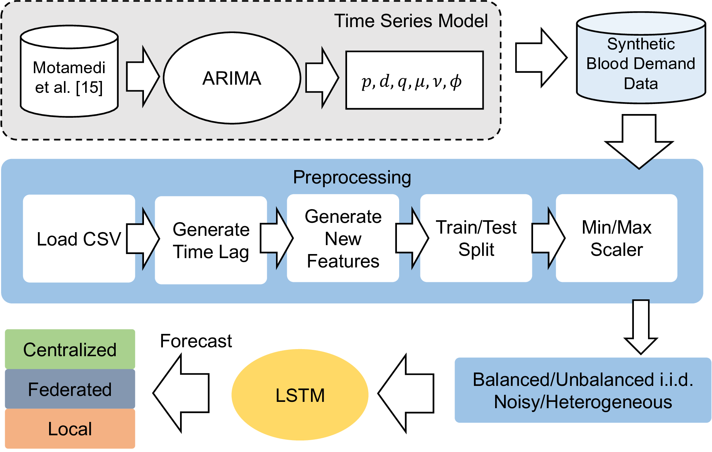

# fl-blood-supply-chain

Federated learning for blood supply chain. Simulation code repo for the paper [Federated Blood Supply Chain Demand Forecasting: A Case Study](https://openreview.net/forum?id=2c0hdQDvf5g), published in KDD 2023 International Workshop on Federated Learning for Distributed Data Mining.


## Overview

Federated learning offers a decentralized approach when it comes to training a machine learning model. It allows multiple parties to collabortively train a predictive model without sharing their data. This project aims to explore the possibility of using federated learning to train a predictive model for blood supply chain.

<p align="center">
  <br />
  Figure 1. Project architecture overview.
</p>

This repo contains the code for the project. We are exploring the possibility of using federated learning to train a predictive model for blood supply chain using simulated data based on ARIMA model.

In this project, we are using Flower, a federated learning framework for PyTorch, to simulate the federated learning process. We are using a LSTM model as the baseline for the centralized training. The data pipeline is shown in the figure below.

<p align="center">
  <br />
  Figure 2. Proposed data pipeline.
</p>


## Installation
- Make sure you have conda installed
- Run the following command to install the required packages
- `install.sh` has the shell script that creates new conda environment and installs the required packages
```bash
source install.sh
```

## Usage
- Make sure you are in the right conda environment before running the code
- In the directory `arima`, it contains script that generates the data for clients 1 - 5
- First, we need to generate the data for the clients. The data is generated based on ARIMA model. The data is generated for 5 clients. The data is stored in the `arima/data` directory.Each Python file has a function that generates the data for each client. For example, you may run the following command that generates data for the balanced iid case. The data will be stored in the `arima/data` directory. 
```bash
python generate_case_balanced_iid.py
```

```bash
source run.sh
```
- In the directory `flower`, it contains `central.py` which is a LSTM model as a baseline for the centralized training. 
- `run.sh` contains the script which runs the code for the centralized training and the federated learning simulation which will also start the localized training for each client. After running the simulations, the results will be stored as both pdfs and html format in the `flower/evaluation` directory.

## Results

- After running `run.sh`, open `DASHBOARD.html` to see all the results, and the saved models wil be inside the `flower/saved_models` directory.
- Current approach uses data generated from ARIMA model for training and predictions

## Reference

\[15\] Maryam Motamedi, Na Li, Douglas G Down, and Nancy M Heddle. 2021. Demand
forecasting for platelet usage: from univariate time series to multivariate models.
[arXiv preprint arXiv:2101.02305](https://arxiv.org/abs/2101.02305) (2021)

## Citation

```
@inproceedings{wei2023federated,
  title={Federated Blood Supply Chain Demand Forecasting: A Case Study},
  author={Wei, Hanzhe and Li, Na and Wu, Jiajun and Zhou, Jiayu and Drew, Steve},
  booktitle={International Workshop on Federated Learning for Distributed Data Mining},
  year={2023}
}
```
